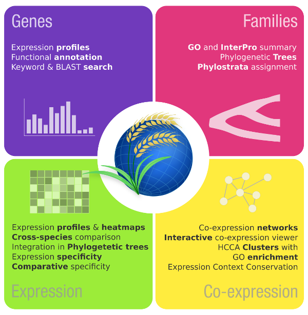

# *CoNekT:* Coexpression Network Toolkit

 CoNekT, the **Co**expression **Net**work **T**oolkit, 
documentation and code. 

If you use CoNekT in your research please cite: **CoNekT: an open-source framework for comparative genomic and transcriptomic network analyses.**
Proost *et al*. 2018. ( [https://doi.org/10.1093/nar/gky336](https://doi.org/10.1093/nar/gky336) )

What is CoNekT ?
----------------

CoNekT is an online platform that allows users to browse expression profiles, study expression specificty, co-expression
networks and more across different species.

Here you can find **tutorials** how to use the public version along with the **source-code** and build instructions that 
allow you to **host your own instance** with other species or in-house data.

Changelog
---------

v1.1

  * General tree import included
  * Updated dependencies that had known security vulnerabilities and adjusted code where necessary
  * Various small tweaks

v1.0

  * Initial release
  
Tutorials
---------

  * [The Basics](docs/tutorials/001_basics.md)
  * [Expression profiles, heatmaps and specificity](docs/tutorials/002_expression_profiles.md)
  * [Gene Families and Phylogenetic trees](docs/tutorials/003_gene_families_trees.md)
  * [Comparing specificity](docs/tutorials/004_compare_specificity.md)
  * [Coexpression Networks and Clusters](docs/tutorials/005_coexpression_networks_clusters.md)
  
  
Anything missing ? Further questions ? Don't hesitate to [contact](mailto:sebastian.proost@gmail.com) us.

Setting up CoNekT
-----------------
Below are the instructions to set up and host your own CoNekT instance.

  * [Linux Installation instructions](docs/install_linux.md)
  * [Windows Installation instructions](docs/install_windows.md)
  * [Run website](docs/run_website.md)
  * [Build CoNekT](docs/building_conekt.md): Upload your data to the platform using the Admin interface
  
  
Optional steps (recommended for production environments)
  * [Connecting with MySQL/MariaDB](docs/connect_mysql.md)
  * [Setting up CoNekT with apache and mod_wsgi](docs/apache_wsgi.md)

Acknowledgements
----------------

CoNekT is based upon many open-source projects, check the full list [here](docs/acknowledgements.md). 

Contact
-------

Issues via GitHub are preferred way to report bug or provide feedback.

  * [Sebastian Proost](https://www.kuleuven.be/wieiswie/en/person/00123248) ( https://www.kuleuven.be/wieiswie/en/person/00123248 )
