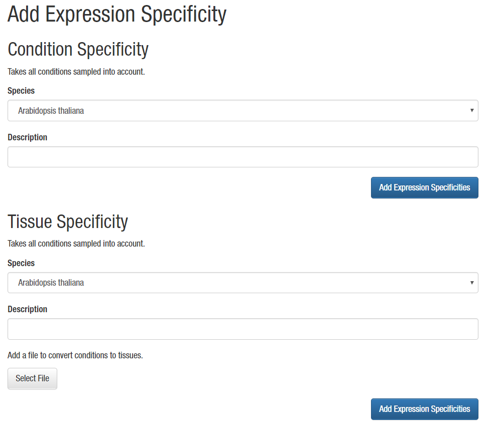

# Adding expression data

Expression data should be processed using [LSTrAP](https://github.molgen.mpg.de/proost/LSTrAP), 
this will generate the expression matrix, coexpression networks and 
clusters that can be directly imported into CoNekt. Note that in 
some cases additional files, containing meta information, need to be 
provided.
 
## Adding expression profiles

In the 'Admin panel', under 'Add' -> 'Expression profiles'. Select the
species and the source (currently only LSTrAP expression matrices are supported). 

Next, select the expression matrix (generated using LSTrAP). Using a 
normalized (TPM or RPKM) matrix is strongly recommended !

Furthermore two additional files need to be provided, one that links the
run identifiers to specific conditions. This tab delimited file should 
be structured as indicated below, a one-line header (which is ignored) 
and two columns, the first with the sample ID and the second with a short
description of the condition sampled. Samples with the same description
will be treated as replicates ! Omitting the condition description will
exclude the sample from the profiles.


```
SampleID    ConditionDescription
SRR068987	Endosperm
SRR314813	Seedlings, 11 DAG
SRR314814	
SRR314815	Flowers (floral buds)
SRR314816
...
```

For profile plots on the website most likely a custom order of conditions
is preferred. (We usually order tissues from bottom to top) A file to 
specify this needs to be provided, conditions need to be stated in the 
orther they should appear in the plot.
Furthermore a color for that condition in the plot needs to be added in 
rgba() format. See the example below.

```
Roots (apex), 7 DAG	rgba(153, 51, 0, 0.5)
Roots (differentation zone), 4 DAP	rgba(153, 51, 0, 0.5)
Roots (elongation zone), 4 DAP	rgba(153, 51, 0, 0.5)
Roots (meristematic zone), 4 DAP	rgba(153, 51, 0, 0.5)
Roots (QC cells), 6 DAS	rgba(153, 51, 0, 0.5)
Roots (stele cells), 7 DAS	rgba(153, 51, 0, 0.5)
Roots (tip)	rgba(153, 51, 0, 0.5)
Leaves (rosette), 21 DAG	rgba(0, 153, 51, 0.5)
Leaves (rosette), 29 DAG	rgba(0, 153, 51, 0.5)
...
```

If all files are selected click 'Add Expression Profiles' to upload the
data and add everything to the database.


## Calculating expression specificity and summerized profiles

To enable Specificity searches, SPM values need to be pre-calculated. From the admin menu 
select 'Add' -> 'Expression specificty'.



Here you have two options available. The first one will calculate SPM values for all conditions
in the profiles. Here you simply need to **select the species**, **enter a description** and click 
**"Add Expression Specificities"**.

In case different conditions need to be grouped, the second option should be used. Here you 
**select the species** and **enter a description** similarly to the previous. Additionally a
tab-delimited text file is required grouping conditions into broader categories. 

```
Roots (apex), 7 DAG Roots   rgba(153, 51, 0, 0.5)
Roots (differentation zone), 4 DAP  Roots   rgba(153, 51, 0, 0.5)
Roots (elongation zone), 4 DAP  Roots   rgba(153, 51, 0, 0.5)
Roots (meristematic zone), 4 DAP    Roots   rgba(153, 51, 0, 0.5)
Roots (QC cells), 6 DAS Roots   rgba(153, 51, 0, 0.5)
...
```

Three columns are required, (i) the label in the full profile, (ii) the group it belongs to 
and (iii) the color for that group. After adding that file click **"Add Expression Specificities"**
in that section.

These broader categories can be used in the **comparative heatmap** and combined with **phylogenetic trees**, to compare expression across species. To do this use the [CRUD](008_crud.md) interface for ConditionTissues and set the **in_tree** field to true. Note that this is **only** supported for the broad categories defined through the **Add Tissue Specificity** feature (selecting the specific conditions here will result in errors when viewing trees).
