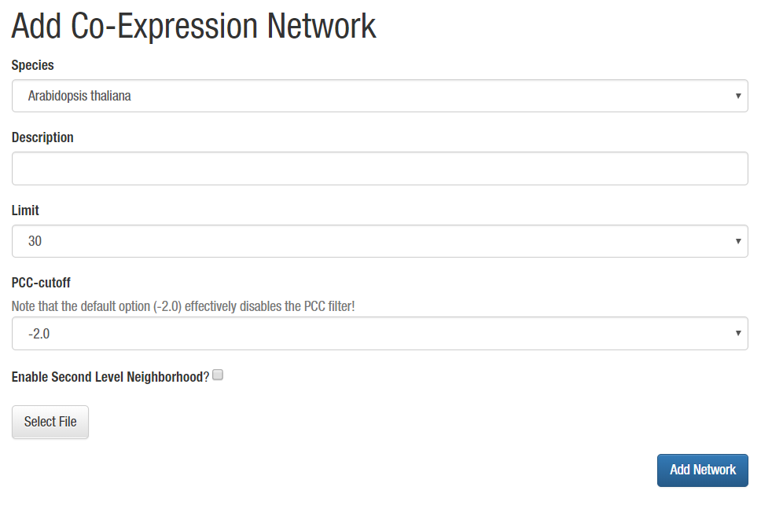
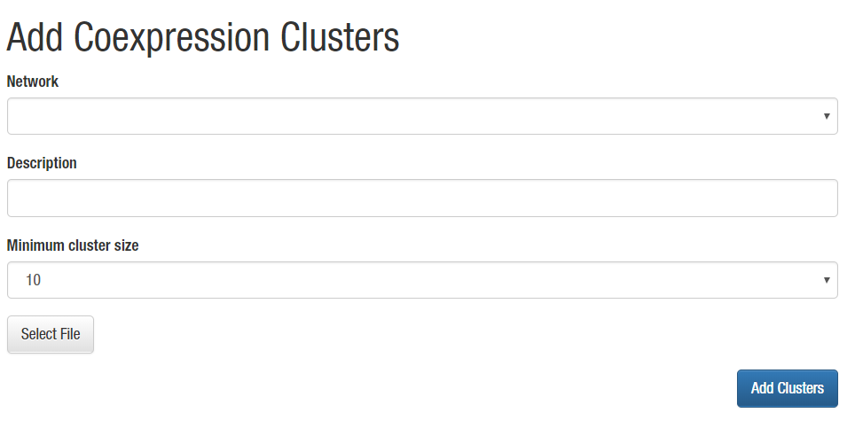
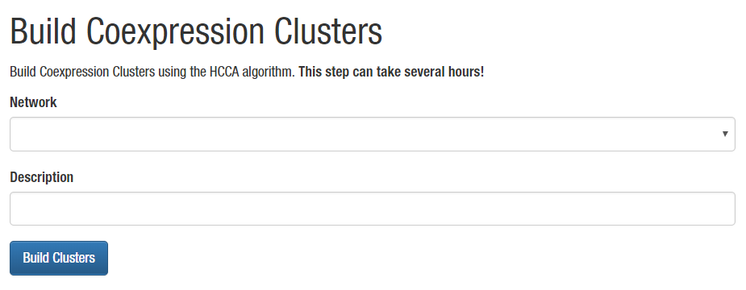

# Adding co-expression data and clusters

## Adding co-expression network

Coexpression networks from [LSTrAP](https://github.molgen.mpg.de/proost/LSTrAP/) (Pearson Correlation based) can be directly imported
and are converted to a rank-based network upon importing the file.

In the admin menu select 'Add' -> 'Add Co-Expression Network'. 

**Select the species first** and enter a suitable **description**. Next select a 
**Limit**, this specifies the maximum rank to keep. Lower values will retain fewer,
but more reliable links where higher values result in a denser network.

A **PCC-cutoff** can be combined with the rank based cutoff. Turn this to -2 to 
disable the filter.

For sparse networks, a gene's neighborhood can be extended from direct neighbors 
only to include neighbors of neighbors (aka the second level). If you wish to do 
so tick the checkbox **Enable Second Level Neighborhood?**. WARNING: Enabling this
option for dense networks will significantly impact the performance of several of 
CoNekT's features.

Finally the full expression table as generated by LSTrAP should be selected. Click 
**"Add Network"** to upload the file (note files can be large, this step can take a
while) and import the data into the database. 

## Adding co-expression clusters

Co-expression clusters can either be imported or generated using a built-in 
clustering algorithm (Heuristic Cluster Chiseling Algorithm). 

### Importing MCL Clusters

MCL based clusters (which are included in LSTrAP output) can be imported into LSTrAP.
'Add' -> 'Coexpression Clusters' in the admin panel give you an interface where you 
can **select an existing network**, add a **description** for the new clusters and 
indicate a **minimal size** (to avoid including small clusters). Finally select the **MCL
output** using **Select File** and click **Add Clusters**

### Building HCCA Clusters

Importing MCL clusters can have the disadvantage that the imported network is
filtered differently and inconsistencies emerge between clusters and networks. To
remedy this, CoNekT allows admins to cluster the imported network using the HCCA.

This is very straightforward, but can be time consuming. Make sure the webserver 
doesn't have a timeout (or use the build in one). 

Select a network, add a description for the clusters and click **Build Clusters**.