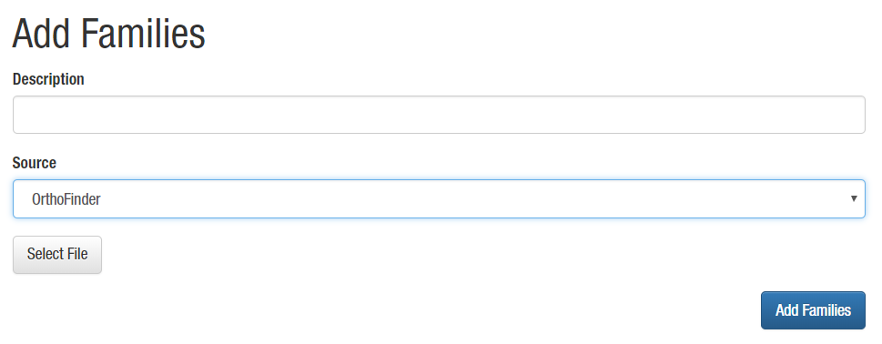
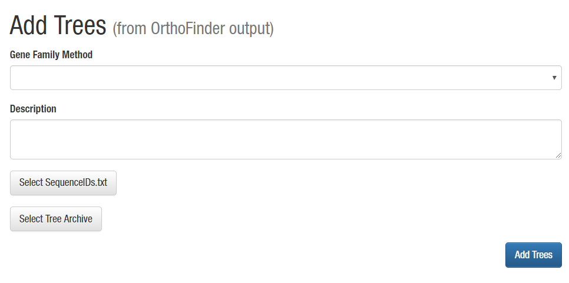

# Adding OrthoGroups with Trees and Gene Families

When building OrthoGroups and Gene families for CoNekT the easiest way to go about
this is to add the species to the database, and export the protein fastas from 
CoNekT. This ensures all IDs are the same.

## Importing OrthoGroups and Gene Families
Output from [OrthoFinder](https://github.com/davidemms/OrthoFinder/) and (tribe)MCL can be directly imported. To do so, 
enter a description, select the type of data you wish to import and select the required file (see below). Hit 
**Add Families** to upload the file and create the gene families in the database.

For OrthoFinder, select Orthogroups.txt, from the output directory. For (tribe)MCL pick the 
file with the final output (all members of a gene family on one line). Gene family names for MCL output will be 
generated, for OrthoFinder output an additional ID will be added to the group ID.

Furthermore a general option is now available (CoNekT v1.1 and up), this requires the same format as OrthoFinder. 
The difference is that the gene family names are left untouched. Use if you plan on using the general tree import in 
the next step. **Don't include dots in the group names!**

Example:
```
OG0000000: AT1G01050 AT2G46860 CP00006G01390 CP00057G00730 OS04G59040 OS05G36260 OS10G26600 VV15G04990
OG0000001: AT3G53620 CP00188G00180 OS01G74350 OS02G47600 OS05G02310 VV02G03060 VV04G11410
OG0000002: AT2G18230
OG0000003: AT4G01480
OG0000004: OS01G64670
```

Note: While you can use Orthogroups from all OrthoFinder versions, importing trees currently is only possible with 
version 1.1.x.



## Importing Trees (OrthoFinder 1.1.x only)

[OrthoFinder 1.1.x](https://github.com/davidemms/OrthoFinder/releases/tag/1.1.10)'s phylogenetic trees, produced by 
 [DCLpar](https://www.cs.hmc.edu/~yjw/software/dlcpar/), can
be imported into CoNekT. These can be found in the 
**./Results_Jan01/Orthologues_Jan01/WorkingDirectory/dlcpar** (note that the date depends on the day you ran OrthoFinder
 in this example Jan01).  

To do so **first create a tar gzip file, with a .tgz extension** containing all the 
**rooted** trees (and only those trees). In linux this can be done using the [*tar* command](https://www.howtogeek.com/248780/how-to-compress-and-extract-files-using-the-tar-command-on-linux/). 
 
 ```bash
 
# first navigate to the dlcpar directory that contains the trees
# execute the command below.
# This will create a file orthofinder_trees.tgz that can be uploaded
tar -zcvf orthofinder_trees.tgz OG*_tree_id.txt
```
 
Windows users can use [7-zip](https://www.7-zip.org/), a free tool to create archives, to create this file.

Furthermore you will need to locate the file **SequenceIDs.txt** which is 
used to convert OrthoFinder's internal IDs back to CoNekT's. This file can be 
found in **./Results_Jan01/WorkingDirectory**, and again the date is part of the directory structure, so ensure this 
will vary depending on when you ran OrthoFinder.

Note on OrthoFinder >= 2.0: OrthoFinder 2.0 and above changed the way trees are handled and stores the trees in a 
different format. This is currently not supported by CoNekT.

As of CoNekT v1.1 a general tree import is available. You need one newick tree per file, the tree needs to be **rooted** 
and be devoid of multi-forcations (only bifurcations are supported). The file names need to match the groups names in 
the  database with .txt extension. These files need to be added into an archive using the command below.

 ```bash
# This will create a file conekt_trees.tgz that can be uploaded
tar -zcvf conekt_trees.tgz *.txt
```



First select the **OrthoFinder families** you wish to add trees to. Next **add a
description** and finally select the **gzip file** with all trees and 
**SequenceIDs.txt**.

Currently adding trees to other types of gene families is not supported.

## Adding Clades

For clades to be detected correctly, clade definitions need to be stored in the 
database from 'Add->'Clades'. This is done using a JSON object structured as the
example here:

```json
{
    "Arabidopsis": {
        "species": ["ath"],
        "tree": null
    },
    "Poplar": {
        "species": ["ptr"],
        "tree": null
    },
    "Rice": {
        "species": ["osa"],
        "tree": null
    },
    "Rosids": {
        "species": ["ptr", "ath"],
        "tree": "(ptr:0.01, ath:0.01);"
    },
    "Angiosperms": {
        "species": ["ptr", "ath", "osa"],
        "tree": "((ptr:0.03, ath:0.03):0.01, osa:0.04);"
    }
}
```

**Dictionary keys** are different clades, within each dict you have to specify two 
things : the **species**, which contain an array of short names of the species in that
clade and a **tree** with a newick tree of that clade.

## Tree Reconciliation

Once trees are correctly uploaded to the database and the clades are defined, the tree reconsiliation can be started 
from the the admin panel's menu under : 'Build'->'Reconcile Trees'
