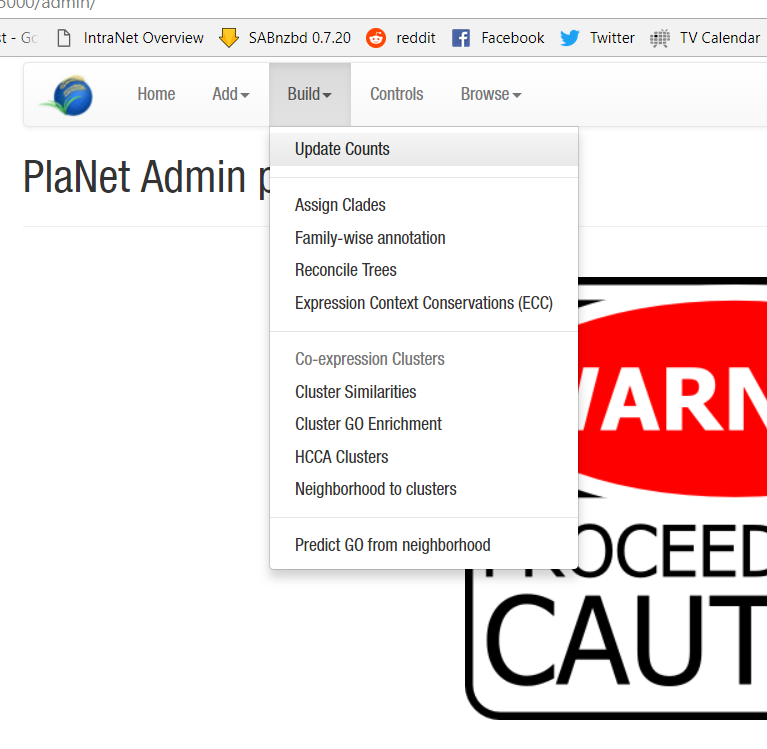

# Computing enrichments, similarities, and counts ... 

Many features in CoNekT rely on pre-populating tables with data. This allows search
functions to quickly filter on certain terms.

## Computing Counts

After building or extending a database updating counts is crucial for several 
features to work. In 'Build' click on **'Update Counts'** to start this process.

Other things to pre-calculate are :

**Clade Assignments** : 'Build'->'Assign Clades'
**GO summaries for families** : 'Build'->'Family-wise annotation'
**Reconsiliated Tree** : 'Build'->'Reconsile Trees'
**Expression Context Conservation** (ECC) : 'Build'->'Expression Context Conservation (ECC)'

**Similarities** between co-expression clusters : 'Build'->'Cluster Similarities'
**GO Enrichment** for co-expression clusters : 'Build'->'Cluster GO Enrichment'
**Predict GO labels** from the network : 'Build'->'Predict GO from Neighborhood'

Note that if any of these are missing the corresponding features in the DB will
simply be disabled.

Finally there is one **Experimental** feature that turns neighborhoods into clusters.
while this enables GO-enrichment for neighborhoods, it messes up cluster 
similarities. This can be useful in case no network clustering is performed. 
'Build' -> 'Neighborhood to clusters'