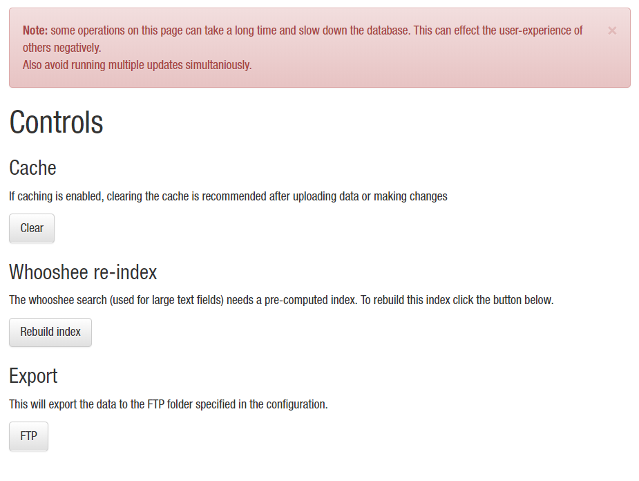

# Controls

  * The Control panel in the admin menu allows to **clear the cache** (recommended after 
updating the database). 

  * the Whooshee index can be rebuild here. In case the database was build with 
  Whooshee disabled, from here the index can be generated after updating the config.
  
  * Some data can be exported e.g. for distribution via FTP. Files will be stored
  in the FTP folder specified in the configuration.
  
  