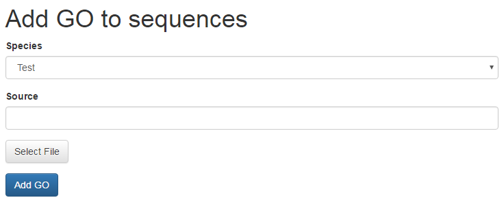
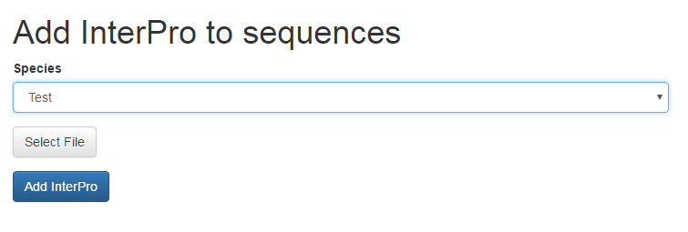
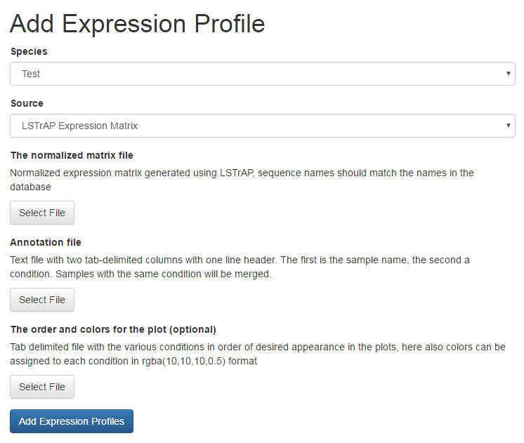

# Building CoNekt

## Using the admin panel to build CoNekt

Make sure *LOGIN_ENABLED=True* in *config.py* and the database was build 
with and admin account. Next, go to the website, log in and (once logged
in) click on the username (admin) in the top right corner. Select 'Admin
Panel' from the drop-down menu.


The Admin Panel will welcome you with a large warning. Deleting data, 
overwriting or changing entries here can ruin a carefully set up 
database. Make sure to read instructions on pages and this documentation
to avoid losing work. When working with an existing database, make sure
to back up the database before proceeding.

### Adding GO terms and InterPro domains

Descriptions for GO terms and InterPro domains should be added before
adding functional annotation. This step should be completed first. In
the top menu click on 'Add' and select 'Functional Data'. 
 


The GO descriptions can be obtained from the Gene Ontology Consortium's 
official website in OBO format [here](http://geneontology.org/page/download-ontology).
InterPro domains and descriptions (called the **Entry list**) are found on EBI InterPro's download pages [here](https://www.ebi.ac.uk/interpro/download.html), 
decompress the .gz file prior to uploading. 

Click the buttons on the page and select the corresponding files, next 
click 'Add functional data' to upload the files to your server and 
import them in the database. This process can take some time, do not 
close the browser window. 

**Note: The existing tables will be cleared before adding the new 
definitions. Do not update this information if GO/InterPro data is 
already added to species !**


### Adding a new species and functional data

Adding a species requires multiple steps, follow the steps below for 
each species. 

#### Adding the species and sequences

On the 'Admin panel', under 'Add' select 'Species'. Fill in the 
full scientific name (or the name you wish to appear on the website) for
the species and select a 'three letter code', that is unque for the
species (we recommend a combination of genus and species cfr. **H**omo 
**sa**piens = hsa, note that while three characters is recommended it is
not required, longer codes are possible). 

Some visualizations require a color specific for each species, these can 
be entered using the controls below (clicking the box opens a color 
picker, there is no need to manually add in hex values).

Finally, select a fasta file with **coding sequences**, in the fasta 
headers the gene name (and only the name) needs to be present. These are
the names genes will receive on the website.

```
>Gene1
ATG...
>Gene2
ATG... 
```

To upload the data and add the species to the database click 'Add species'


#### Adding functional Annotation to sequences

**GO** terms can be imported from tab delimited files, containing 3 
columns: gene name, GO label and the evidence tag.

```
Gene1   GO:0004621  IEA
Gene1   GO:0004622  IEA
Gene2   GO:0000227  ISS
...
```

On the 'Admin panel', under 'Add' -> 'GO Genes' such a file can be 
uploaded, for a species. Additionally a description needs to be provided
from where the GO terms in the file originate from (the source). 
 


**InterPro** domains can be imported directly from [InterProScan](http://www.ebi.ac.uk/interpro/download.html) output. 
To do so, in the 'Admin panel', under 'Add' -> 'InterPro genes' select a species, select the file and click 'Add InterPro'



### Adding expression data

Expression data should be processed using [LSTrAP](https://github.molgen.mpg.de/proost/LSTrAP), 
this will generate the expression matrix, coexpression networks and 
clusters that can be directly imported into CoNekt. Note that in 
some cases additional files, containing meta information, need to be 
provided.
 
#### Adding expression profiles

In the 'Admin panel', under 'Add' -> 'Expression profiles'. Select the
species and the source (currently only LSTrAP expression matrices are supported). 

Next, select the expression matrix (generated using LSTrAP). Using a 
normalized (TPM or RPKM) matrix is strongly recommended !

Furthermore two additional files need to be provided, one that links the
run identifiers to specific conditions. This tab delimited file should 
be structured as indicated below, a one-line header (which is ignored) 
and two columns, the first with the sample ID and the second with a short
description of the condition sampled. Samples with the same description
will be treated as replicates ! Omitting the condition description will
exclude the sample from the profiles.


```
SampleID    ConditionDescription
SRR068987	Endosperm
SRR314813	Seedlings, 11 DAG
SRR314814	
SRR314815	Flowers (floral buds)
SRR314816
...
```

For profile plots on the website most likely a custum order of conditions
is preferred. (We usually order tissues from bottom to top) A file to 
specify this needs to be provided, conditions need to be stated in the 
orther they should appear in the plot.
Furthermore a color for that condition in the plot needs to be added in 
rgba() format. See the example below.

```
Roots (apex), 7 DAG	rgba(153, 51, 0, 0.5)
Roots (differentation zone), 4 DAP	rgba(153, 51, 0, 0.5)
Roots (elongation zone), 4 DAP	rgba(153, 51, 0, 0.5)
Roots (meristematic zone), 4 DAP	rgba(153, 51, 0, 0.5)
Roots (QC cells), 6 DAS	rgba(153, 51, 0, 0.5)
Roots (stele cells), 7 DAS	rgba(153, 51, 0, 0.5)
Roots (tip)	rgba(153, 51, 0, 0.5)
Leaves (rosette), 21 DAG	rgba(0, 153, 51, 0.5)
Leaves (rosette), 29 DAG	rgba(0, 153, 51, 0.5)
...
```

If all files are selected click 'Add Expression Profiles' to upload the
data and add everything to the database.





#### Adding coexpression network

*UNDER CONSTRUCTION*

#### Adding coexpression clusters

*UNDER CONSTRUCTION*

### Adding external references

*UNDER CONSTRUCTION*

### Computing enrichments, similarities, and counts ... 

*UNDER CONSTRUCTION*