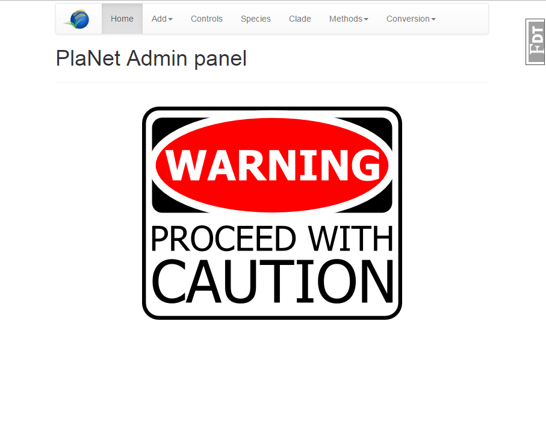
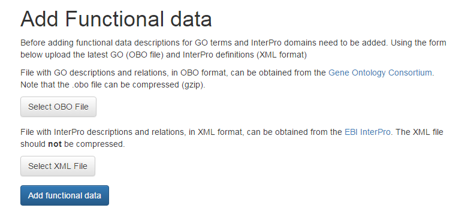

# Building PlaNet

## Using the admin panel to build PlaNet 2.0

Make sure *LOGIN_ENABLED=True* in *config.py* and the database was build 
with and admin account. Next, go to the website, log in and (once logged
in) click on the username (admin) in the top right corner. Select 'Admin
Panel' from the drop-down menu.

The Admin Panel will welcome you with a large warning. Deleting data, 
overwriting or changing entries here can ruin a carefully set up 
database. Make sure to read instructions on pages and this documentation
to avoid losing work. When working with an existing database, make sure
to back up the database before proceeding.

### Adding GO terms and InterPro domains

Descriptions for GO terms and InterPro domains should be added before
adding functional annotation. This step should be completed first. In
the top menu click on 'Add' and select 'Functional Data'. 
 

The GO descriptions can be obtained from the Gene Ontology Consortium's 
official website in OBO format [here](http://geneontology.org/page/download-ontology).
InterPro domains and descriptions (called the **Entry list**) are found on EBI InterPro's download pages [here](https://www.ebi.ac.uk/interpro/download.html), 
decompress the .gz file prior to uploading. 

Click the buttons on the page and select the corresponding files, next 
click 'Add functional data' to upload the files to your server and 
import them in the database. This process can take some time, do not 
close the browser window. 

**Note: The existing tables will be cleared before adding the new 
definitions. Do not update this information if GO/InterPro data is 
already added to species !**

### Adding a new species and associated data

Adding a species requires multiple steps, follow the steps below for 
each species. 

#### Adding the species and sequences

On the 'Admin panel', under 'Add' select 'Species'. Fill in the 
full scientific name (or the name you wish to appear on the website) for
the species and select a 'three letter code', that is unque for the
species (we recommend a combination of genus and species cfr. **H**omo 
**sa**piens = hsa, note that while three characters is recommended it is
not required, longer codes are possible). 

Some visualizations require a color specific for each species, these can 
be entered using the controls below (clicking the box opens a color 
picker, there is no need to manually add in hex values).

Finally, select a fasta file with **coding sequences**, in the fasta 
headers the gene name (and only the name) needs to be present. These are
the names genes will receive on the website.

> \>Gene1
> ATG... 
> \>Gene2 
> ATG... 

To upload the data and add the species to the database click 'Add species'

#### Adding functional Annotation to sequences

## Using the build script

*UNDER CONSTRUCTION*