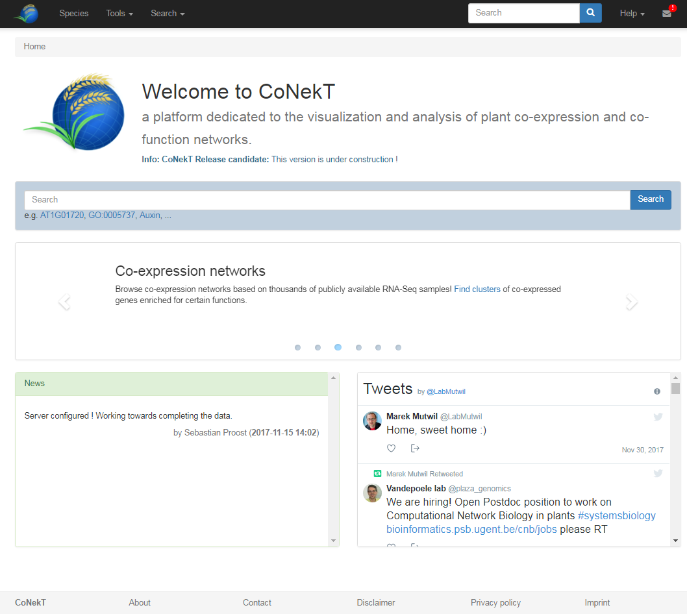
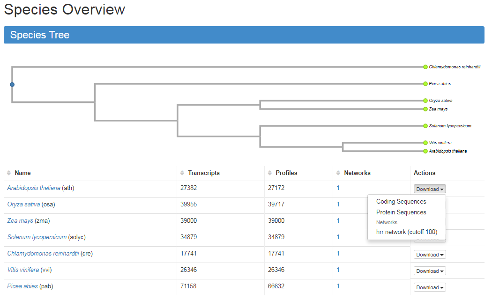

# Tutorial: The basics

## Home page and Species page

On the CoNekT you quickly can get updated about announcements (e.g. server downtime), recent changes and general 
updates from the lab's twitter feed. 

To check out which **species** are currently included in CoNekT, a species page can be accessed through the **menu button** 
named **Species** on the top of the page. This will bring up a page with the species tree and a table with species included
along with some general statistics.

Note the buttons to **download** all gene **sequences** and the complete co-expression **networks**. Click on a species
name to bring up a brief description and other relevant information (e.g. useful links, ... )

## Search

