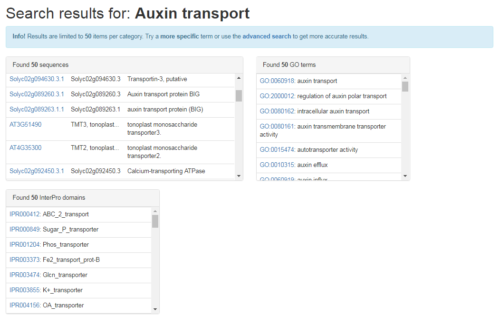

# Tutorial: The basics

Welcome to the CoNekT tutorial ! 

## Home page and Species page

On the CoNekT you quickly can get updated about announcements (e.g. server downtime), recent changes and general 
updates from the lab's twitter feed. 

To check out which **species** are currently included in CoNekT, a species page can be accessed through the **menu button** 
named **Species** on the top of the page. This will bring up a page with the species tree and a table with species included
along with some general statistics.

Note the buttons to **download** all gene **sequences** and the complete co-expression **networks**. Click on a species
name to bring up a brief description and other relevant information (e.g. useful links, ... )

## Search

On each page there is a **search box** available in the top right corner. This is a broad keyword search and will try to
find genes, profiles, GO terms, InterPro domains and/or gene families based on their identifiers or descriptions.

As seen in the results from searching for **Auxin transport** partial matches are also picked up and only the 50 hits in 
each category are retained. The **advanced search** allows for more specific searches and should be used to narrow down
results further.

Gene identifiers link to details about the sequence, functional annotation but also expression profile which is covered 
in the [next section](002_expression_profiles.md). 