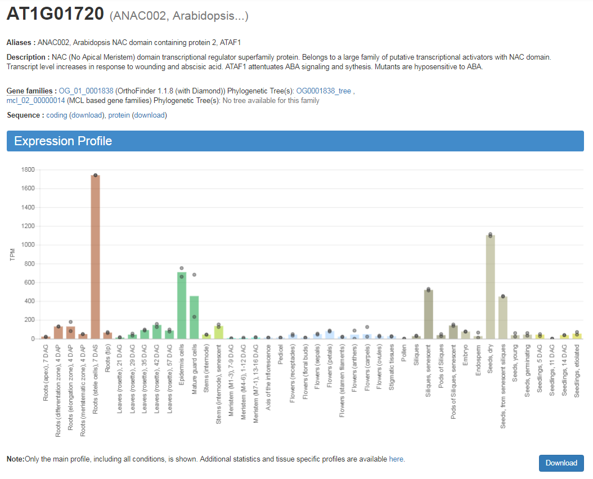
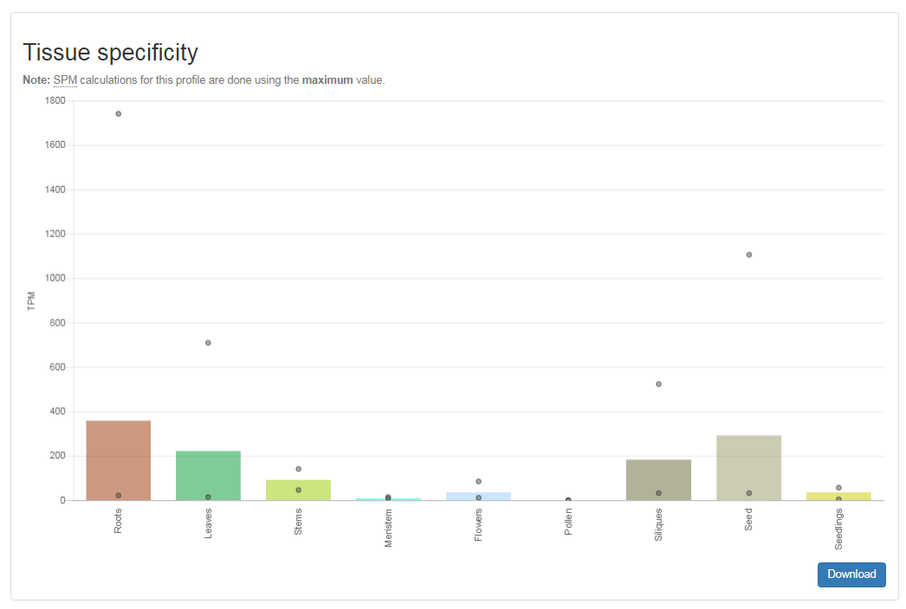

# Tutorial: Expression profiles, heatmaps and specificity

The key feature of CoNekT is the inclusion of thousands, carefully annotated, publicly available RNASeq samples
derived from the [Sequence Read Archive](https://www.ncbi.nlm.nih.gov/sra). For each gene a summary of its expression in
the annotated samples, the expression profile, is available. Data for a collection of genes can be used to create
heatmaps and by applying various statistics genes specific for certain conditions, tissues or organs can be detected.

## Expression Profiles

On the top of each sequence page you can see the expression profile, highlighting in which annotated samples the gene
is expressed and at which level. 

Furthermore, summarized profiles with fewer conditions are available (link below the plot). 

The **download** buttons below expression plots allow you to download the raw data 

## Heatmaps

## Expression Specificity

## Export *all* expressed genes

