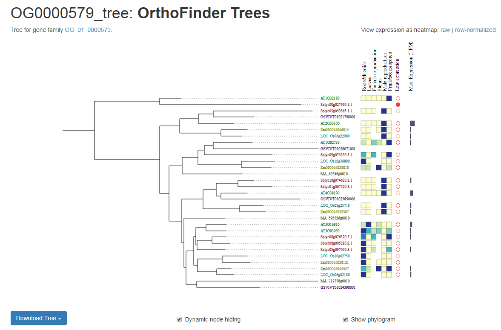

# Tutorial: Gene families and Phylogenetic Trees

Homologous genes (genes derived from a common ancestor) are usually group into gene families. Orthologs, genes derived
from a common ancestor through speciation, are similarly grouped into OrthoGroups. CoNekT supports 
[tribeMCL](https://www.ncbi.nlm.nih.gov/pubmed/11917018) and [OrthoFinder](https://github.com/davidemms/OrthoFinder) for 
Homologous groups and OrthoGroups respectively.

## Gene Families

## Phylogenetic Trees

Phylogenetic Trees generated by [OrthoFinder](https://github.com/davidemms/OrthoFinder) can be imported into CoNekT. These
can be accessed from gene pages for sequences included in the tree or the corresponding gene family page. 

A unique feature of CoNekT is that conditions can be manually curated per species and expression levels of genes in 
comparable tissues/organs can be added to the phylogenetic tree. This allows for changes in expression patterns between
duplicated genes or after speciation events to be visualized. 

 

In the example above various genes related with cellulose synthase (an important component of plant cell walls) is shown.
Here it is immediately clear that some groups of cellulose syntases are specific for leaves while others play a role in 
reproductive structure. 