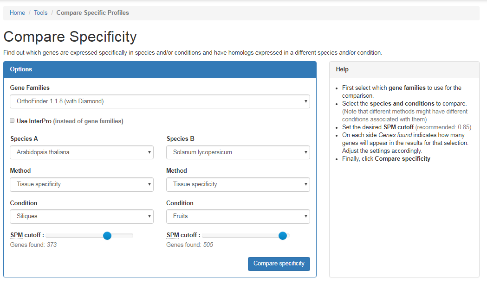
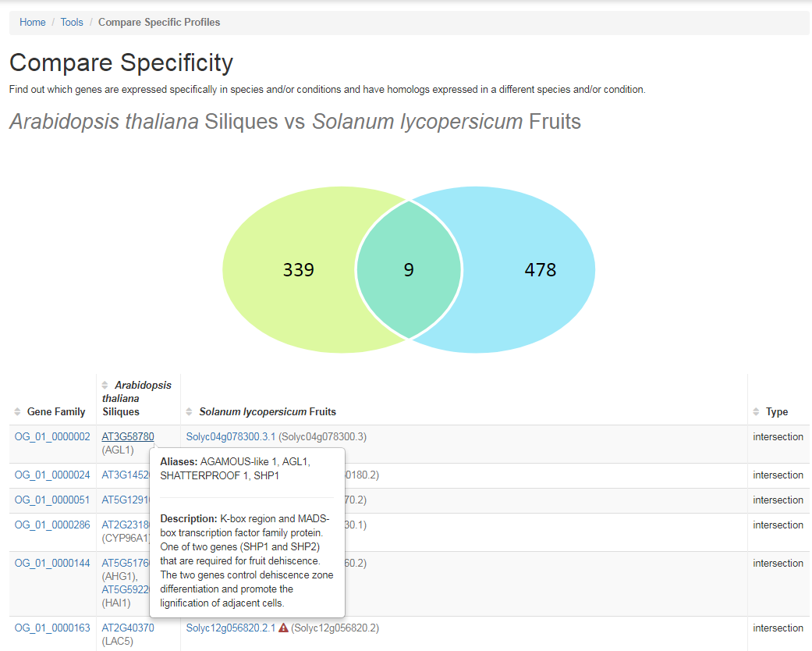
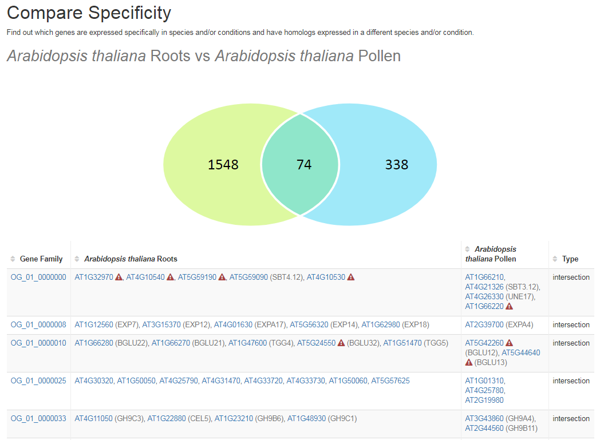

# Tutorial: Compare Specificity

Tissue specificity can be combined with gene families to pick up genes with conserved expression between species but
also to detect genes within one species that sub- or neo-functionalized after duplication. Look at the examples below to
see how.

## Conserved Expression

Some low-abudant genes can cause false positives when looking for tissue/condition specificity. These adverse results can
be greatly reduced by looking for genes that are specific in a certain tissue in one species and have an ortholog 
(or homolog) specifically for the corresponding tissue is another species.

In this example *Arabidopsis thaliana* silique specific genes are matched with their orthologs expressed specifically in
Tomato (*Solanum lycopersicum*) fruis. This feature is available from the tools menu below the button 
**Compare specificity**. The SPM (Specificity Metric) slider for tomato is adjusted to yield a similar number of hits
as in *Arabidopsis thaliana*. 

 

In the resulting page orthogroups with a member expressed in one, the other or both selected conditions are shown in a
venn diagram, with a detailed list below. By hovering over a gene, the description can be observed. 

 

Here, the first reported hit is AGL1 *aka.* SHATTERPROOF 1, a known 
[fruit development gene](https://www.ncbi.nlm.nih.gov/pubmed/10903201), clearly illustrating the power of this approach.

## Sub- or Neofunctionalization

Similarly you can compare *Arabidopsis thaliana* root specific genes (default SPM of 0.85) with pollen in the same 
species (using the same SPM cutoff). 

 

Here **74** orthogroups are reported to show signs of sub- or neo-functionalization. This includes 
**Cellulose Synthase (like)** genes included in the example from the [previous section](004_compare_specificity.md).