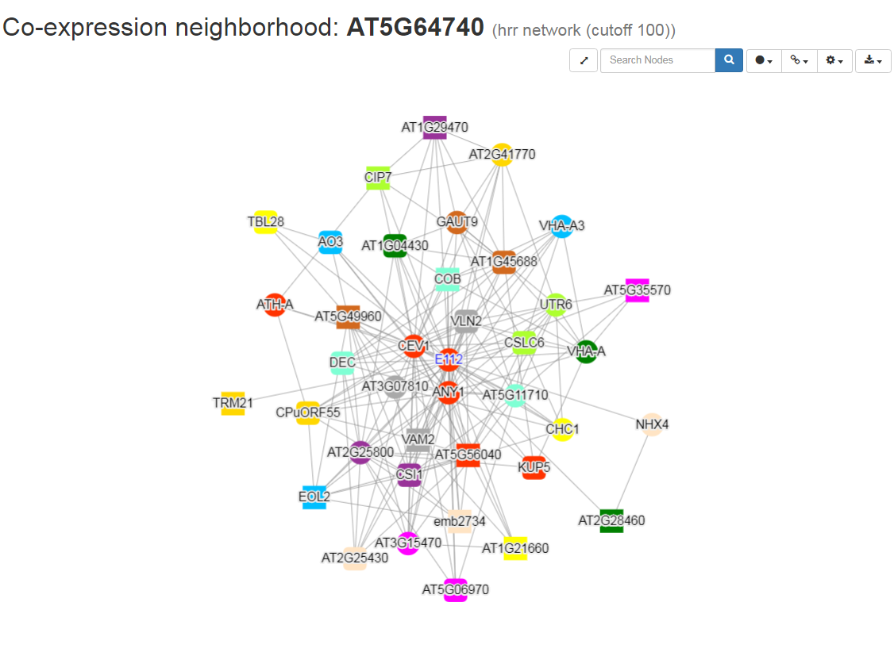
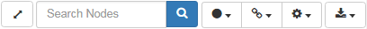
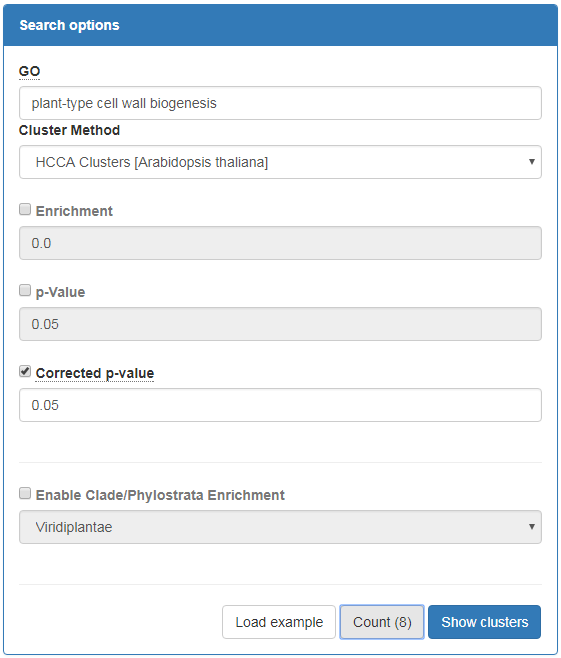

# Tutorial: Coexpression Networks and Clusters

## Coexpression intro

Genes which display a similar expression profile across many samples are considered co-expressed. As co-expression is
often attributed to a shared regulatory mechanism, co-expressed genes are likely to be involved in the same biological
process. 

 

In the example two profiles of co-expressed genes are show, the strength of their co-expression is indicated by the 
[Pearson Correlation Coefficient](https://en.wikipedia.org/wiki/Pearson_correlation_coefficient) (PCC) which is 
determined taking all samples into account (not just the ones included inthe profile)

## Navigating Coexpression Neighborhoods

A gene's coexpressed genes (referred to as the coexpression neighborhood) can be found on the sequence page.  

The table icon  can be used to access a table with details on all 
coexpressed genes. The network icon  lead to a network graph
visualized using [Cytoscape.js](http://js.cytoscape.org/) of the gene and its coexpression neighborhood.
 
 

You are able to pan (by dragging) and zoom (by scrolling) the graph. Node can be selected and moved by dragging.
Furthermore on the top-right corner there is a control bar.

From left to right, there is the **Reset View** button which will zoom the graph to fit the window. The **search box** 
where a gene ID, IntePro domain or GO term can be entered to highlight all matching genes, then there is the **node**, **edge** 
and **layout** controls which can be used to change the appearance of the nodes, edges and layout respectively. The right-most
button is the **export** button which allow you to export the graph as an image (PNG and SVG are supported) or to a format
which can be loaded in third party (XGMML) tools for local analysis.

## Coexpression Clusters 

The coexpression network can also be compartmentalized using algorithms into more manageable clusters. These can be
accessed from the sequences directly as a table (), 
network (), 
profile comparison () and 
heatmap ().

In CoNekT functional enrichment for clusters is pre-calculated and enrichment for phylostrata/clades. The former can 
shed light on the function of the cluster's members including those which currently lack annotation. The latter hints
at the point in time when this feature evolved. To pick up co-expression clusters of interest, a search function is 
provided in the tools menu, under **Find enriched clusters**.

After specifying parameters, the **Count** button can be clicked to find out how many clusters meet the current criteria.

When looking for clusters enriched for **plant-type cell wall biogenesis** in *Arabidopsis thaliana*, leaving other options
at their default values eight clusters are found. This included **Cluster_66** which contains CESA1 , CESA6 one of the cellulose 
synthases and **Cluster_148** which contains Cellulose Synthase like proteins. The other genes, lacking functional 
annotation, in these clusters would be good canditates to knock out and test the phenotype of mutants for defects in their
roots.

