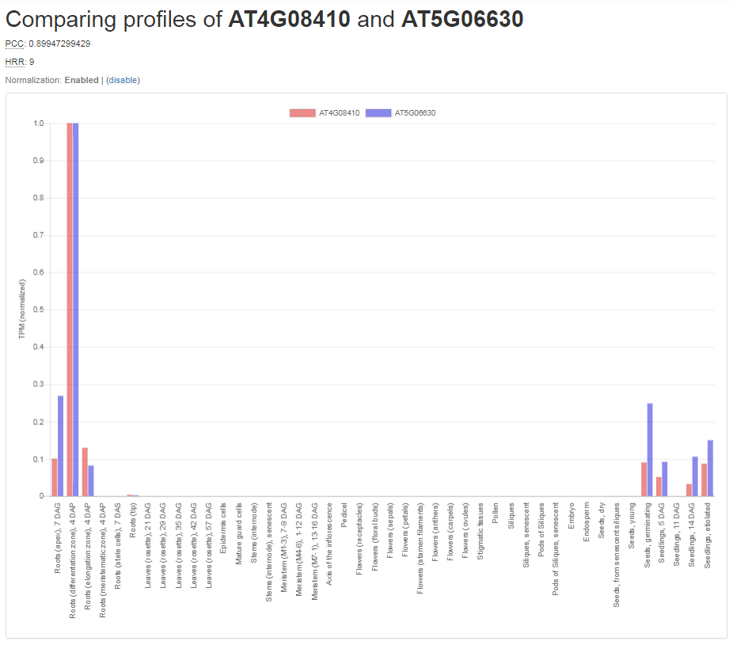

# Tutorial: Coexpression Networks and Clusters

## Coexpression intro

Genes which display a similar expression profile across many samples are considered co-expressed. As co-expression is
often attributed to a shared regulatory mechanism, co-expressed genes are likely to be involved in the same biological
process. 

 

In the example two profiles of co-expressed genes are show, the strength of their co-expression is indicated by the 
[Pearson Correlation Coefficient](https://en.wikipedia.org/wiki/Pearson_correlation_coefficient) (PCC) which is 
determined taking all samples into account (not just the ones included inthe profile)

## Navigating Coexpression Neighborhoods

A gene's coexpressed genes (referred to as the coexpression neighborhood) can be found on the sequence page.  

 of the gene and its coexpression neighborhood.
 
 

## Coexpression Clusters 